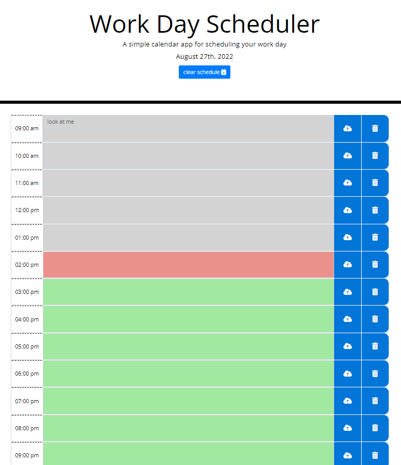

# day-scheduler

deployed site: https://bens213.github.io/day-scheduler/
## about
this simple scheduler utilizes third-party APIs to style the page and access the current time and date

## technologies used
html, css, javascript, moment.js, font awesome, and bootstrap

## screen shot
